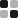

<p align="center">
  <a href="https://tesserai.design/?utm_source=github&utm_medium=readme"><picture><source media="(prefers-color-scheme: dark)" srcset="assets/logo-dark.svg"></picture></a>
</p>

# tesserai

Your design system, in your repo, followed by your coding agent.

[tesserai](https://tesserai.design/?utm_source=github&utm_medium=readme) turns your site's look (its colors, type and corners) into a design system. You see it on real screens, checked against WCAG and Apple's and Material's guidelines. Then one command installs it into your project as components you own. This repository is the part that runs in your project: the token engine, the component templates, and the CLI with its MCP server. It's MIT licensed.

```sh
npx @tesserai/cli init https://tesserai.design/s/<your-share-link>
```

React (Base UI, Radix or React Aria), Vue (Reka UI) and Svelte 5 (Bits UI) components, a Tailwind CSS 4 theme, and W3C DTCG tokens. Exports for SwiftUI, Jetpack Compose, Flutter, SCSS, MUI, Mantine, Chakra, Panda and StyleX.

## For coding agents

`init` registers the MCP server for Claude Code and Cursor. The agent reads the system's tokens, components, contrast checks and design guidelines, and changes the system rather than hand-styling a screen. To add it yourself:

```sh
claude mcp add tesserai -- npx -y @tesserai/cli mcp
```

[](https://cursor.com/en/install-mcp?name=tesserai&config=eyJjb21tYW5kIjoibnB4IiwiYXJncyI6WyIteSIsIkB0ZXNzZXJhaS9jbGkiLCJtY3AiXX0%3D)
[](https://vscode.dev/redirect/mcp/install?name=tesserai&config=%7B%22type%22%3A%22stdio%22%2C%22command%22%3A%22npx%22%2C%22args%22%3A%5B%22-y%22%2C%22%40tesserai%2Fcli%22%2C%22mcp%22%5D%7D)

Installed from an editor, the server asks the editor which folder it has open and serves that project. This repository is also a Claude Code and Cursor plugin, with a skill that tells the agent how to use the system, and `npx skills add tesseraihq/tesserai` adds the skill to other agents.

| Tool | What it does |
| --- | --- |
| `outline` | The whole system in brief: palettes, meanings, type, spacing, radius, every component and its options |
| `component_guide`, `example_page` | How to use a component, and whole forms and pages written with the components |
| `get_tokens`, `get_component`, `explain`, `usage` | Read tokens and components, follow a token to its value, see what depends on it |
| `check_contrast`, `guidelines` | Failing color pairs with fixes; the design guidelines themselves |
| `list_operations`, `describe_operation`, `apply_changes` | Change the system (colors, type, spacing, a component's look) and regenerate |
| `scan` | How the app uses the system: uses, overrides, never-used components and options, hard-coded values |
| `sync`, `import_design_system`, `list_overrides`, `upload_scan` | Pull the latest design; bring an existing look in; what's been customised; keep a scan with the system |

## Commands

| Command | What it does |
| --- | --- |
| `init <link or bundle>` | Install a system into the project |
| `sync [link or bundle]` | Pull the latest version and regenerate, keeping files you changed |
| `scan` | How the app uses its system, and what to change in it (`--fix` replaces exact matches) |
| `import` | Bring the project's existing look in, from its stylesheets, token files and Tailwind config |
| `doctor` | Check the project, the system and the link it follows |
| `export <format>` | The system for another stack |
| `storybook` | A Storybook with a story per component, light and dark, with accessibility checks |
| `mcp` | Serve the system to coding agents over stdio |

Full reference: [tesserai.design/docs](https://tesserai.design/docs).

## In this repository

| Package | What |
| --- | --- |
| [`packages/core`](packages/core) | The design-system model, OKLCH color scales, generators, operations, contrast and guideline checks, emitters |
| [`packages/templates`](packages/templates) | Every component, once per library |
| [`packages/cli`](packages/cli) | `@tesserai/cli` on npm, and the MCP server |
| [`packages/vue-fixture`](packages/vue-fixture), [`packages/svelte-fixture`](packages/svelte-fixture) | Projects that compile every generated component, to prove the templates |

The builder at [tesserai.design](https://tesserai.design) (the editor, AI editing, sharing, teams) is a separate, hosted product. You don't need it to use what's here with a system you already have, and a system you install keeps working if you stop using it.

## Contributing

See [CONTRIBUTING.md](CONTRIBUTING.md). In short: `pnpm install && pnpm build && pnpm verify`.

## License

[MIT](LICENSE). The components and CSS the CLI writes into your project are yours. The tesserai name and logo are covered by [TRADEMARK.md](TRADEMARK.md).
